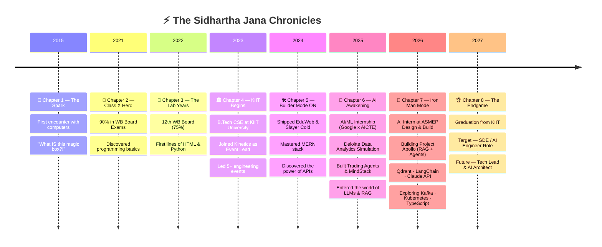

<!-- ==================== HERO BANNER ==================== -->
<div align="center">


<!-- Typing SVG -->


<br/>

<!-- Role Badges -->
<p>
  
  
  
  
</p>

<!-- Info Badges -->
<p>
  
  
  
</p>

<!-- Social Links -->
<p>
  <a href="https://sidhartha-portfolio.vercel.app" target="_blank">
    
  </a>
  <a href="https://linkedin.com/in/Sidhartha412" target="_blank">
    
  </a>
  <a href="mailto:sidharthajana412@gmail.com">
    
  </a>
  <a href="https://github.com/coldwinds003" target="_blank">
    
  </a>
</p>

<!-- Dynamic Stats -->
<p>
  
  
</p>

</div>

---

<!-- ==================== ABOUT ME ==================== -->

## 🧬 About Me

> *"I don't just write code — I architect experiences, engineer intelligence, and ship products that matter."*

I'm a **4th-year B.Tech CSE student at KIIT University** and a passionate **Full-Stack MERN + AI Engineer** with **4+ shipped production projects** across fintech, education, and gaming. I love sitting at the intersection of **software engineering** and **artificial intelligence** — building things that are both technically excellent and genuinely useful.

Currently interning as an **AI Intern at ASMEP Design & Build Pvt. Ltd.**, where I'm architecting **Project Apollo** — an internal AI-powered operations platform with RAG pipelines, vector databases, and agentic workflows.

<table>
<tr>
<td width="50%">

### 🚀 Mission
Build AI-powered, cloud-native applications that **solve real-world problems at scale** — bridging the gap between cutting-edge research and production-ready software.

### 🎯 Current Goals
- 🏗️ Ship **Project Apollo** (AI Ops Platform)
- 📚 Master **System Design & Distributed Systems**
- ☁️ Get **AWS / GCP certified**
- 🤝 Contribute to **open-source AI tools**

</td>
<td width="50%">

### 🔥 What I'm Building
- 🤖 **RAG pipelines** with Qdrant vector DB
- 🧠 **Agentic AI workflows** with LangChain
- 📊 **Internal ops platform** (Project Apollo)
- 🎮 Browser games & fullstack web apps

### 📚 What I'm Learning
- Kubernetes & container orchestration
- Apache Kafka for event streaming
- Advanced Prompt Engineering & LLM fine-tuning
- TypeScript for enterprise-grade backends

</td>
</tr>
</table>

### 💡 Interests
`⚡ Agentic AI` · `🔍 Semantic Search` · `☁️ Cloud Native` · `🗄️ Distributed Databases` · `🎮 Game Dev` · `📈 FinTech` · `🔐 Auth & Security` · `🎨 UI/UX Design`

---

<!-- ==================== TECH STACK ==================== -->

## 🛠️ Tech Arsenal

### 🗣️ Languages
<p align="center">
  
  
  
  
  
  
  
  
</p>

### 🎨 Frontend
<p align="center">
  
  
  
  
  
</p>

### ⚙️ Backend
<p align="center">
  
  
  
  
  
</p>

### 🗄️ Databases
<p align="center">
  
  
  
  
  
  
</p>

### ☁️ Cloud, DevOps & Infra
<p align="center">
  
  
  
  
  
  
</p>

### 🤖 AI / ML & LLM Stack
<p align="center">
  
  
  
  
  
  
  
  
</p>

### 🧰 Tools & Platforms
<p align="center">
  
  
  
  
  
  
</p>

---

<!-- ==================== CERTIFICATIONS ==================== -->

## 🏆 Certifications & Badges

<div align="center">

| 🏅 Certification | 🏢 Issuer | 📅 Year |
|:---|:---|:---|
| 🤖 **Claude Certified Engineer** | Anthropic | 2025 |
| 🌐 **AI/ML Virtual Internship** (10 weeks) | AICTE × EduSkills × Google for Developers | 2025 |
| 📊 **Data Analytics & Forensic Technology** | Deloitte via Forage | 2025 |
| 🐍 **Python for Beginners** | Simplilearn SkillUp | 2025 |
| 🤖 **Agentic AI Bootcamp** (7 days) | UiPath Student Community, KIIT | 2025 |
| ☁️ **Cloud Computing Fundamentals** | *In Progress* | 2026 |
| 🐳 **Kubernetes Fundamentals** | *In Progress* | 2026 |
| 📨 **Kafka Fundamentals** | *In Progress* | 2026 |

</div>

<p align="center">
  
  
  
  
  
  
</p>

---

<!-- ==================== PROJECTS ==================== -->

## 🌟 Featured Projects

<div align="center">

### 📈 Trading Agents — FinTech Bid Estimator
  

> 💹 A sophisticated FinTech web application that leverages ML-powered prediction APIs to estimate bid/pass trading decisions — built with a data-driven, real-time dashboard.

| 🔧 | Details |
|:---|:---|
| **Stack** |     |
| **Highlights** | Real-time dynamic rendering · ML prediction API · Responsive dashboard |
| **My Role** | Solely responsible for entire frontend development |

[](https://github.com/coldwinds003/Trading-Agents)

---

### 📝 MindStack — Full-Stack Note-Taking App
  

> 🧠 A complete MERN stack app with automatic timestamping, persistent storage, and full CRUD via RESTful API — real-time UI that keeps your notes beautifully organized.

| 🔧 | Details |
|:---|:---|
| **Stack** |     |
| **Highlights** | Auto-timestamping · RESTful API · Real-time UI updates |
| **My Role** | Solo full-stack implementation |

[](https://github.com/coldwinds003/MindStack)

---

### 🎓 EduWeb — Education Web Application
  

> 📚 A clean, blazing-fast education platform with structured layouts, responsive cross-device design, and optimized Vercel deployment.

| 🔧 | Details |
|:---|:---|
| **Stack** |     |
| **Highlights** | Optimized builds · Fast load times · Fully responsive |

[](https://eduweb-umbe.vercel.app) [](https://github.com/coldwinds003/EduWeb)

---

### 🎮 Slayer Cold — Browser-Based Web Game
  

> ⚔️ A fast-paced browser game engineered with an optimized game loop for silky smooth 60 FPS gameplay — works flawlessly across all major browsers.

| 🔧 | Details |
|:---|:---|
| **Stack** |    |
| **Highlights** | Optimized game loop · 60 FPS · Cross-browser |

[](https://slayer-cold.vercel.app) [](https://github.com/coldwinds003/Slayer-Cold)

---

### 🚀 Project Apollo — AI Internal Ops Platform *(In Progress)*
 

> 🏗️ Enterprise AI-powered operations platform at ASMEP Design & Build — featuring RAG pipelines, Qdrant vector search, multi-collection document intelligence, and agentic workflows.

| 🔧 | Details |
|:---|:---|
| **AI Stack** |     |
| **Backend** |   |
| **Highlights** | Multi-collection RAG · Semantic search · Agentic AI · HNSW indexing |

</div>

---

<!-- ==================== CAREER TIMELINE ==================== -->

## 🎬 My Origin Story *(Disney/Pixar Edition)*

> *Every hero has a beginning. Mine started with a curious kid and a blinking cursor...*



---

<!-- ==================== EXPERIENCE ==================== -->

## 💼 Experience

### 🤖 AI Intern — ASMEP Design & Build Pvt. Ltd.
`2026 – Present` · Bhubaneswar, Odisha

- 🏗️ Architecting **Project Apollo** — an AI-powered internal operations platform
- 🔍 Building **RAG pipelines** using Qdrant vector DB with multi-collection document intelligence
- 🤖 Developing **agentic workflows** with LangChain + Claude API + OpenAI
- 📊 Cross-departmental requirement gathering and stakeholder reporting
- 🧮 Exploring **PCA + TF-IDF** for document similarity and semantic analysis

> *Collaborating with: Aditya (Project Lead) · Santosh Sir (Delivery Head) · Siddesh Sir (Export Head)*

---

### 🎪 Event Management Lead — Kinetics, KIIT University
`2023 – Present` · Bhubaneswar, Odisha

- 🎯 Planned and executed **5+ engineering & innovation-focused events and hackathons**
- 👥 Coordinated **10+ member teams** across logistics, scheduling & communications
- 📊 Collaborated with faculty mentors and **50+ technical participants**
- ⚡ Reduced coordination delays through clear scheduling & communication frameworks

<p>
  
  
  
  
  
</p>

---

<!-- ==================== AI/ML TABLE ==================== -->

## 🤖 AI / ML Expertise

<div align="center">

| 🧠 Domain | 📊 Level | 🔬 Details |
|:---|:---|:---|
| **RAG Pipelines** | ⭐⭐⭐⭐ Applied | Qdrant vector DB, multi-collection architecture, HNSW indexing |
| **LLM Integration** | ⭐⭐⭐⭐ Applied | Claude API, OpenAI API, prompt engineering, agentic workflows |
| **LangChain** | ⭐⭐⭐ Working | Chains, agents, document loaders, retrievers |
| **ML Fundamentals** | ⭐⭐⭐ Foundational | 10-week AI/ML Internship (AICTE × Google) |
| **Data Analytics** | ⭐⭐⭐ Working | Deloitte simulation, PCA, TF-IDF, scikit-learn |
| **Agentic AI** | ⭐⭐⭐ Exploring | UiPath Bootcamp, multi-agent orchestration |
| **Semantic Search** | ⭐⭐⭐⭐ Applied | Embedding-based retrieval, similarity scoring |

</div>

---

<!-- ==================== GITHUB STATS ==================== -->

## 📊 GitHub Analytics Dashboard

<div align="center">


<br/><br/>


</div>

### 🏅 GitHub Trophies

<div align="center">

</div>

### 📈 Contribution Activity

<div align="center">

</div>

### 🐍 Contribution Snake

<div align="center">
<picture>
  <source media="(prefers-color-scheme: dark)" srcset="https://raw.githubusercontent.com/coldwinds003/coldwinds003/output/github-contribution-grid-snake-dark.svg"/>
  
</picture>
</div>

---

<!-- ==================== ACHIEVEMENTS ==================== -->

## 🏆 Achievements & Recognition

<div align="center">

| 🏅 Achievement | 📋 Details |
|:---|:---|
| 🎓 **Academic Excellence** | 90% in WB Board Class 10 Examinations |
| 🤖 **AI Internship** | Selected for AICTE × EduSkills × Google for Developers AI/ML Program |
| 📊 **Industry Simulation** | Completed Deloitte Data Analysis & Forensic Technology Job Simulation |
| 🚀 **Production Projects** | 4+ shipped apps across FinTech, Education, Gaming & AI |
| 👑 **Event Leader** | Led 5+ technical events with 50+ participants at KIIT |
| 🧠 **AI Engineer** | Building production RAG pipelines & agentic AI systems |

</div>

---

<!-- ==================== COMPETITIVE PROGRAMMING ==================== -->

## 💻 Competitive Programming

<div align="center">

<a href="https://leetcode.com/coldwinds003">
  
</a>
<a href="https://www.geeksforgeeks.org/user/sidhartha412">
  
</a>
<a href="https://www.hackerrank.com/coldwinds003">
  
</a>
<a href="https://www.codechef.com/users/coldwinds003">
  
</a>

</div>

---

<!-- ==================== CURRENT FOCUS ==================== -->

## 🎯 Current Focus

```yaml
👤 who_am_i:
  name: "Sidhartha Jana"
  alias: "coldwinds003"
  role: "Full Stack + AI Engineer"
  location: "Bhubaneswar, India 🇮🇳"

🔭 currently_working_on:
  - "Project Apollo — AI internal ops platform (ASMEP)"
  - "RAG pipelines with Qdrant + LangChain + Claude API"
  - "TypeScript migration for backend services"

📚 currently_learning:
  - "Kubernetes & container orchestration"
  - "Apache Kafka for event streaming"
  - "Advanced System Design & Distributed Computing"
  - "LLM fine-tuning & Prompt Engineering"

🤝 open_to:
  - "Software Engineering Internships (SDE / AI Engineer)"
  - "Full-time SDE / AI Engineer roles (2027)"
  - "Open Source Contributions"
  - "AI/ML collaboration projects"
  - "Freelance full-stack / AI projects"

⚡ fun_fact: >
  I once built a browser game, a FinTech app, and a
  RAG pipeline in the same semester. Coffee-fueled chaos? 
  No — just organized engineering. ☕🚀
```

---

<!-- ==================== MEME / FUN ==================== -->

## 😂 Dev Humor Corner

<div align="center">

```
    When the RAG pipeline finally returns 
    the right context after 3 days of debugging...

    Me:  ✅ It works!
    
    Also me 5 mins later:  💀 But why?
    
    ──────────────────────────────────
    
    git commit -m "fix bug"
    git commit -m "fix the fix"
    git commit -m "ok THIS is the fix"
    git commit -m "I hate this"
    git commit -m "it works don't touch it"
    
    ──────────────────────────────────
    
    "I'll just add a console.log real quick..."
         — me, 3 hours before the demo
```

> 😭 *"99 little bugs in the code, 99 little bugs... take one down, patch it around... 127 little bugs in the code."*

</div>

---

<!-- ==================== CONNECT ==================== -->

## 🤝 Let's Build Something Amazing

<div align="center">

> 💬 *"The best way to predict the future is to build it."* — Alan Kay

<br/>

<a href="mailto:sidharthajana412@gmail.com">
  
</a>
<a href="https://linkedin.com/in/Sidhartha412">
  
</a>
<a href="https://sidhartha-portfolio.vercel.app">
  
</a>
<a href="https://github.com/coldwinds003">
  
</a>

<br/><br/>


<sub><i>⚡ Built with passion, caffeine, and way too many Stack Overflow tabs — by Sidhartha Jana</i></sub>

</div>
